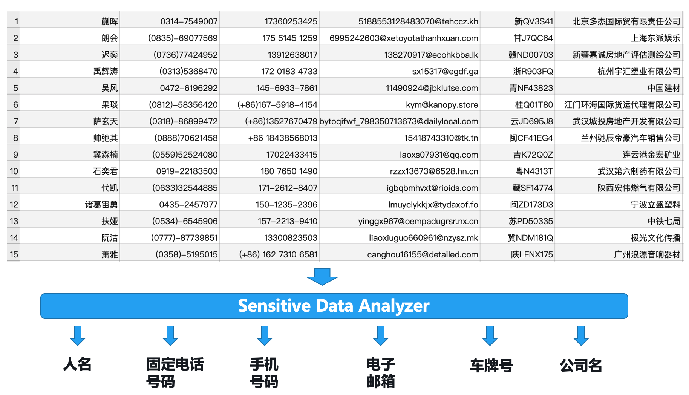
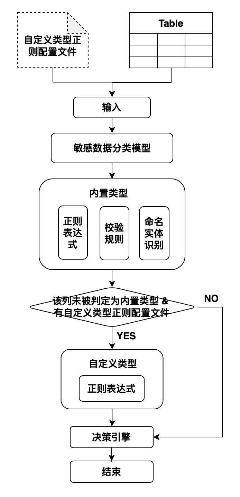

# openDLP

## 简介

openDLP（open data loss prevention）是一个敏感数据识别工具，目前支持对结构化数据表进行敏感数据识别，判断数据表的某一列是何种敏感数据类型（如下图），可以帮助企业进行数据资产分类分级，保护数据安全。openDLP根据不同的敏感数据的特点，采用正则表达式、人工智能算法等不同方法进行敏感数据识别，内置支持了多种敏感数据类型，同时支持自定义敏感数据类型识别。



（注：上图中数据为生成的模拟数据，如有雷同，纯属巧合）


目前内置支持17类敏感数据类型，可以通过自定义正则支持更多类型的识别。对于有地区和语言差异的类型，目前都是支持中国大陆地区、简体中文。具体敏感数据类型如下：

1. 人名

2. 身份证号

3. 护照号

4. 银行卡号

5. 车牌号

6. 电子邮箱

7. 邮政编码

8. 移动手机号码

9. 固定电话号码

10. 地址

11. 公司名

12. 统一社会信用代码

13. 日期

14. 域名

15. IPv4地址

16. IPv6地址

17. MAC地址

    

## 系统识别流程 

系统的整体识别流程如图所示：



**输入：** 输入主要是待识别的数据表，以及一个可选的自定义正则配置json文件。

**敏感数据分类模型：** 使用一个卷积神经网络模型对数据表列中的元素进行多分类，得到元素属于各个敏感类别的概率，然后取概率值最高的3个类型作为该元素的候选敏感数据类型。

**内置类型：** 敏感数据分类模型得到元素的3个候选敏感数据类型后，需要调用每个候选类型的识别模型来识别是否是该类型。各个类型的识别模型主要有三种：正则表达式、校验规则和命名实体识别模型。命名实体识别模型用于识别人名、地名之类用正则表达式不好识别的类型。

**自定义类型：** 如果某一列经过内置类型模块识别后，未被判定为某一个内置类型，且输入参数中有自定义类型正则配置文件，则进入自定义类型识别模块，用自定义正则表达式进行识别。

**决策引擎：** 根据一列中各个元素的识别类型，与敏感数据类型判别阈值，判定某一列所属敏感数据类型。


## 使用方法

### 环境

Python版本：Python 3.7 版本，其他Python版本未经测试。

依赖包：见requirements.txt，执行 pip install -r requirements.txt 安装即可。

### 使用

#### 下载资源文件（可选）

本项目中的命名实体识别使用了HanLP开源项目中的模型，使用前需先下载相关模型文件并解压到指定目录，如未手动下载，第一次运行时会自动下载。

+ [close_tok_pos_ner_srl_dep_sdp_con_electra_small_20210111_124159.zip](https://file.hankcs.com/hanlp/mtl/close_tok_pos_ner_srl_dep_sdp_con_electra_small_20210111_124159.zip) 下载解压到HANLP_HOME/mtl，其中HANLP_HOME默认为/root/.hanlp，可修改。
+ [electra_zh_small_20210706_125427.zip](https://file.hankcs.com/hanlp/transformers/electra_zh_small_20210706_125427.zip) 下载解压到HANLP_HOME/transformers。
+ [char_table.json.zip](https://file.hankcs.com/corpus/char_table.json.zip) 下载解压到HANLP_HOME/thirdparty/file.hankcs.com/corpus。

#### 启动服务

执行 opendlp_server.py 文件启动敏感数据识别服务。

#### 请求服务

敏感数据识别服务主要接收三个参数：

+ to_analyze_file_path：待进行敏感数据识别的表格文件的路径（必需参数），目前仅支持csv文件，且需要有表头。

+ user_define_pattern_file：用户自定义正则表达式json文件（可选参数），例如：

  ```json
  {
      "QQ": ["\\b[1-9][0-9]{4,}\\b"],
      "PASSWORD": ["\\b\\w{6,18}\\b"]
  }
  ```

+ thresholds：判断阈值json串，内容为各个敏感数据类型的判断阈值（可选参数，如不设置则使用默认配置）。例如，某一列中有90%的元素识别为人名，人名类型的阈值为0.8的话，该列类型会被判断为人名，如果人名类型的阈值设置为0.95的话，则不会被判断为人名，会被判断为OTHER。

接口请求调用示例如下（更多示例见tests/test_client.py）：

```python
import grpc
from grpc_module import sensitive_pb2, sensitive_pb2_grpc

def send_request(to_analyze_file_path, user_define_pattern_file=None, thresholds=None):
    request = sensitive_pb2.SensitiveRequest()
    request.to_analyze_file_path = to_analyze_file_path
    if user_define_pattern_file is not None:
        request.user_define_pattern_file = user_define_pattern_file
    if thresholds is not None:
        request.thresholds = thresholds
        
		# ip和端口与sensitive_data_analyzer_server.py中设置的一致
    with grpc.insecure_channel('127.0.0.1:40051') as channel:
        stub = sensitive_pb2_grpc.SensitiveDataAnalyzerServiceStub(channel)
        response = stub.SensitiveAnalyze(request)
        status = response.status
        result = response.result
    return status, result

to_analyze_file_path = 'tests/data/data-udf.csv'
user_define_pattern_file = 'tests/data/pattern.json'
thresholds = '{"QQ":1}'
status, result = send_request(to_analyze_file_path, user_define_pattern_file, thresholds)
print(result)
```

其输出为：

```shell
{"QQ": {"success": true, "type": "OTHER", "fraction": "9/10"}, "PASSWORD": {"success": true, "type": "PASSWORD", "fraction": "10/10"}}
```

“QQ”为数据表中的列名，“success”标识该列是否识别成功，“type”为识别成的敏感数据类型，OTHER表示不是敏感数据类型，“fraction”为该列中识别比例最高的类型的占比，这里的"9/10"的含义是该列有10个元素，有9个识别为了QQ，但QQ的判断阈值设置的是1，大于0.9，所以其类型被判断为了OTHER。

