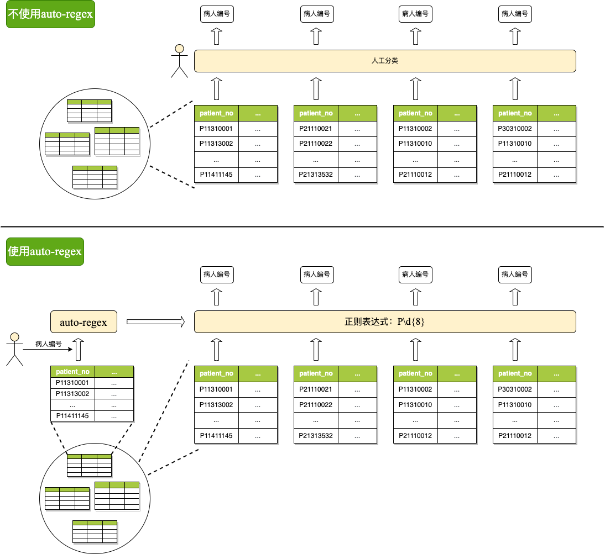

 
 

数据作为一种新型生产要素，数据分类分级是发挥数据价值的关键环节。然而目前数据分类分级时通常需要人工逐个字段地查看数据进行分类，或人工查看数据编写识别数据的正则表达式，效率较低。auto-regex是一个正则表达式智能生成工具，可以基于用户提供的少量某个类型的样本数据，学习该类数据的模式特征，自动生成正则表达式，生成的正则表达式可以用于识别数据库中众多的同类型数据，提高数据分类分级效率。

  

## 应用场景

- 数据分类分级

  数据分类分级场景中，数据库中有大量数据表和字段，人工一个个查看分析标注敏感类型，效率低。通过正则表达式智能生成工具，对每一个敏感类型，只需人工查看少量表，找到一列该类型数据，提供给正则表达式智能生成工具，生成正则表达式，对数据库中其他大量的表字段进行敏感类型识别。

- 数据流动过程中的敏感数据识别

  数据库中的数据在应用程序间流动时在数据分类分级阶段标注的敏感标签一般不会被保留，通过正则表达式智能生成工具生成的正则表达式可以在数据流动的关键节点上进行敏感数据识别，掌握敏感数据的流向。

## 主要特性

- 基于正、负样本数据，自动学习生成正则表达式；
- 考虑了样本数据串中的频繁子字符串，能够捕获到数据中的细节特征。

## 贡献者

+ 哈尔滨工业大学（深圳）数据安全研究院

